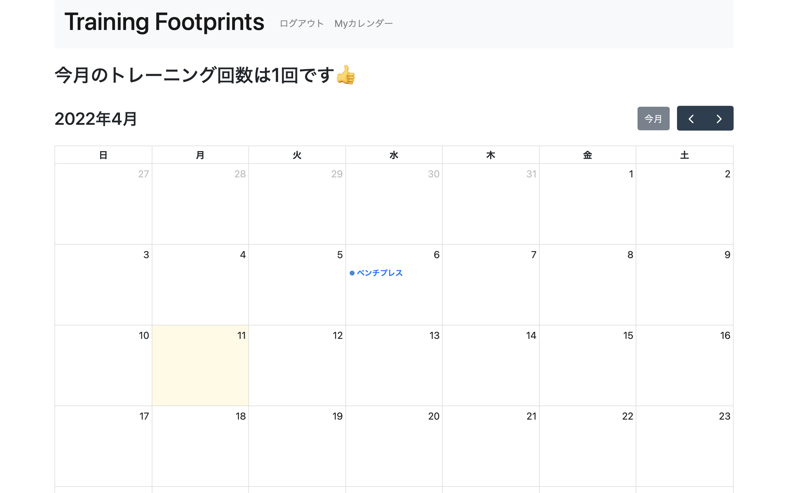
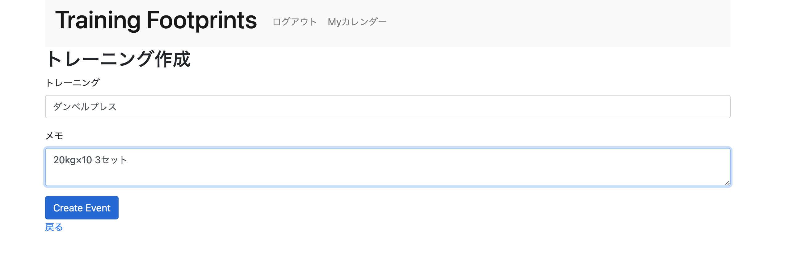
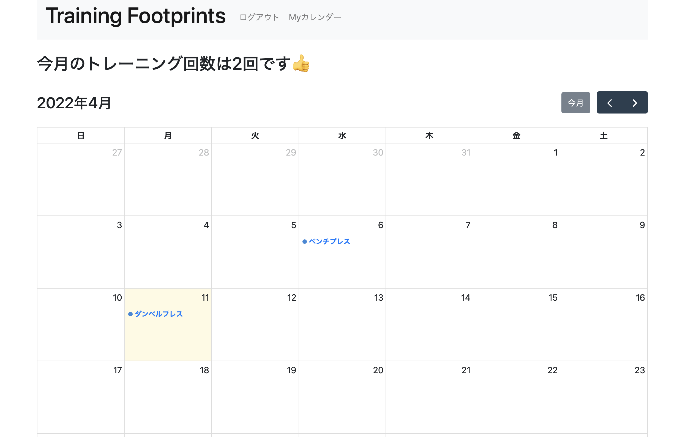

#### This was created for portfolio based on the experience at potepancamp.

#### You can check out the app on [Heroku.](https://rails-kaishi-port.herokuapp.com)


# About
If you use this app, it helps make training a habit by allowing you to record your daily workouts.

# Future features

For now, you can use these features.

* Keep a record of your training.
* Show the history of your training.
* View training records in graphs.
* Login function.
* Guest login function
* Additional training menu functions

# Pages


# Installation

Install full_calendar with yarn command.

```bash
yarn add @fullcalendar/core @fullcalendar/interaction
@fullcalendar/daygrid
```

# Usage
I will explain how to use it.

### 1. Click on a date in the calendar


### 2. Create an event





# Author
 
* name: Nagasaka Kaishi
* e-mail: kaishi0827@icloud.com

# Lisence

[MIT](https://choosealicense.com/licenses/mit/)
